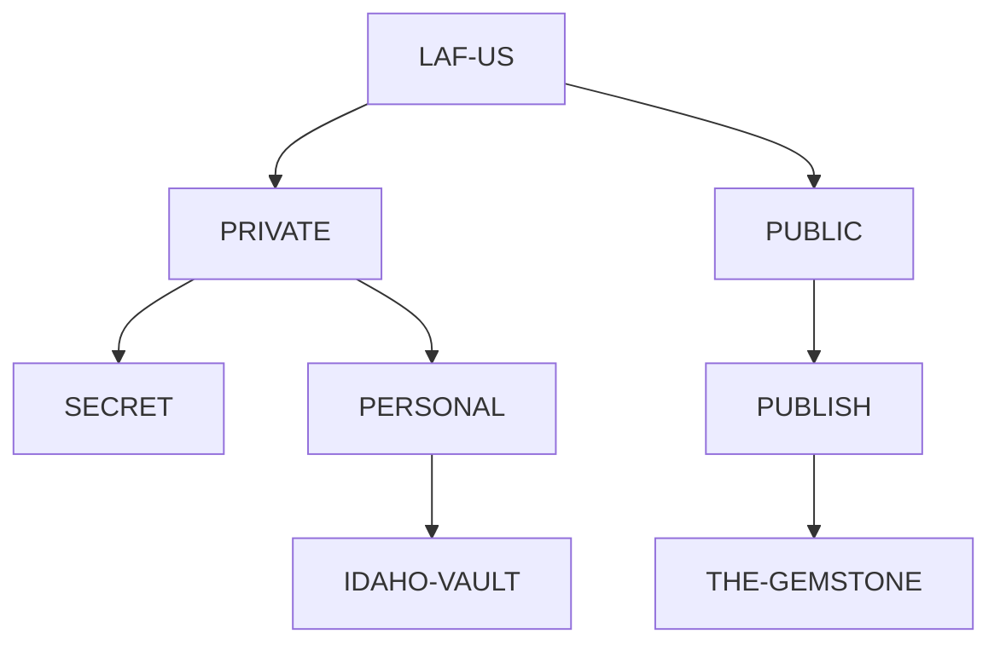

# LAF-USB Five Cores Migration

## Summary

This note captures the current intended consolidation direction for the
`LAF-US` GitHub organization.

The migration target is a **Five Cores** model at the **repo layer**:

1. `PRIVATE`
2. `SECRET`
3. `PERSONAL`
4. `PUBLIC`
5. `PUBLISH`

This is the migration some scattered surfaces have referred to as
**LAF-USB**.

## Core Doctrine

The Five Cores are not five equal peers in pure abstraction. They form a
chambered sovereignty model:

- `PRIVATE` is the broader non-public domain.
- `SECRET` is a higher-secrecy subset of `PRIVATE`.
- `PERSONAL` is a lower-secrecy but still non-public subset of `PRIVATE`.
- `PUBLIC` is the broader public-facing domain.
- `PUBLISH` is a publication subset of `PUBLIC`.

GitHub itself is flat at the organization level. So these subset relations are
**doctrinal and governance relations**, not literal nested GitHub containers.

## Important Distinction

The Five Cores are the **org-level chamber anchors**.

They are not automatically the only repositories that may exist forever. In
practice, the current system still contains:

- chamber anchor repos
- flagship child repos
- tooling/fork exceptions
- legacy or exploratory project repos

The purpose of the migration is to reduce scattered project drift by pushing
work inward toward the chamber anchors.

## State Of Play

The current GitHub shape is:

- `GitHub`
  - organization: `LAF-US`
  - five core repos
  - scattered project repos
  - GitHub teams

This means the organization currently has **two distinct structural layers**:

1. a **repo layer**
2. a **team layer**

They should not be collapsed into one concept.

### Repo Layer

The repo layer currently centers on the Five Cores:

- `PRIVATE`
- `SECRET`
- `PERSONAL`
- `PUBLIC`
- `PUBLISH`

Alongside those are scattered or specialized repos such as:

- `IDAHO-VAULT`
- `THE-GEMSTONE`
- `.github`
- other project, fork, demo, or tooling repos

### Team Layer

The team layer currently includes:

- `LAF-PRIVATE`
- `LAF-PUBLIC`

And under `LAF-PUBLIC`, at least these child teams:

- `LAF-USA`
- `LAF-USB`
- `LAF-USC`

This matters because `LAF-USB` is not just a migration nickname floating in
documents. It is also part of the live GitHub team topology.

## Repo Layer vs Team Layer

Working interpretation:

- repos express chambers, archives, products, and project surfaces
- teams express membership, delegation, review lanes, and org-side grouping

So:

- the **Five Cores** belong to the repo-layer consolidation model
- `LAF-PRIVATE`, `LAF-PUBLIC`, `LAF-USA`, `LAF-USB`, and `LAF-USC` belong to
  the team-layer governance model

The two layers are related, but not identical.

## Current LAF-US Repo Inventory

Observed from the live organization surface on 2026-04-15:

- `PRIVATE`
- `SECRET`
- `PERSONAL`
- `PUBLIC`
- `PUBLISH`
- `IDAHO-VAULT`
- `THE-GEMSTONE`
- `.github`
- `feed-generator`
- `quartz`
- `loganfinney27.github.io`
- `IR-Court-Tracker`
- `IDEX_Artifacts`
- `PyTutorial`
- `demo-repository`

## Proposed Repo Triage Matrix

| Repo | Current Role | Target Chamber | Proposed Action |
| --- | --- | --- | --- |
| `PRIVATE` | chamber anchor | `PRIVATE` | **KEEP** as core anchor |
| `SECRET` | chamber anchor | `PRIVATE > SECRET` | **KEEP** as core anchor |
| `PERSONAL` | chamber anchor | `PRIVATE > PERSONAL` | **KEEP** as core anchor |
| `PUBLIC` | chamber anchor | `PUBLIC` | **KEEP** as core anchor |
| `PUBLISH` | chamber anchor | `PUBLIC > PUBLISH` | **KEEP** as core anchor |
| `IDAHO-VAULT` | flagship working archive | `PRIVATE > PERSONAL` | **KEEP FOR NOW** as flagship child repo; later decide whether to remain distinct or be partially absorbed into `PERSONAL` |
| `THE-GEMSTONE` | flagship publication repo | `PUBLIC > PUBLISH` | **KEEP FOR NOW** as flagship child repo; later decide whether to remain distinct or be partially absorbed into `PUBLISH` |
| `.github` | org-wide infrastructure | org exception | **KEEP** as structural exception; not counted as a chamber core |
| `feed-generator` | publication tooling fork | `PUBLIC > PUBLISH` | **ABSORB OR RETIRE** after extracting any needed publication/feed code |
| `quartz` | publishing/site tooling fork | `PUBLIC > PUBLISH` | **ABSORB OR RETIRE** after deciding whether Quartz remains part of publication infrastructure |
| `loganfinney27.github.io` | pages/site surface | `PUBLIC` or `PUBLIC > PUBLISH` | **RECLASSIFY** and either absorb into publication web stack or retain as narrow exception |
| `IR-Court-Tracker` | public reporting project | `PUBLIC` | **ABSORB OR REHOME** into `PUBLIC` unless it justifies long-term standalone identity |
| `IDEX_Artifacts` | public project/archive | `PUBLIC` or `PUBLIC > PUBLISH` | **ABSORB OR REHOME** based on whether it is working archive or publication product |
| `PyTutorial` | playground / learning repo | `PRIVATE > PERSONAL` or archive | **ARCHIVE OR REHOME**; does not appear to justify independent org-level prominence |
| `demo-repository` | demo/test repo | archive | **ARCHIVE OR DELETE** unless still needed operationally |

## Team Interpretation

The current team structure suggests a second-order organization pattern:

- `LAF-PRIVATE` likely governs the non-public side of the org
- `LAF-PUBLIC` likely governs the public-facing side of the org
- `LAF-USA`, `LAF-USB`, and `LAF-USC` appear to be public-side subdivisions,
  programs, cohorts, or migration lanes

This note does not force a final semantics for those subteams. It only records
that the public side of the org is already more internally articulated than a
single flat `PUBLIC` bucket.

## Tensions That Must Be Resolved Explicitly

### 1. Chamber semantics vs GitHub visibility

The current doctrine places `IDAHO-VAULT` under `PERSONAL`, which is itself a
subset of `PRIVATE`. But the live GitHub repo `LAF-US/IDAHO-VAULT` is public.

That means one of these must be clarified later:

- `PERSONAL` means **personal provenance**, not GitHub privacy status
- or `IDAHO-VAULT` is an intentional public exception inside a conceptually
  personal chamber
- or the chamber model still needs one more refinement

This note does not force that answer. It records the conflict so it is not
silently ignored.

### 2. Five cores vs flagship child repos

If Logan means literally **only five durable repos plus org exceptions**, then
`IDAHO-VAULT` and `THE-GEMSTONE` may eventually need to collapse inward.

If Logan means **five chamber anchors plus a very small number of flagship
children**, then those two likely remain distinct.

For now, the safest interpretation is:

- Five chamber anchors are canonical
- flagship children may remain temporarily
- scattered side projects should be folded inward first

### 3. Repo chambers vs team governance

The repo model and the team model currently overlap without yet being fully
explained in doctrine.

Examples:

- `LAF-USB` appears in migration language and also exists as a child team
- `PUBLIC` exists as a repo anchor while `LAF-PUBLIC` exists as a team anchor
- the public side already has subteam structure that is not yet mirrored in the
  repo doctrine

So part of the migration task is not just repo cleanup. It is explaining how
team topology and repo topology relate.

## Recommended Migration Order

1. Confirm the Five Cores as the canonical org model.
2. Mark `.github` as an explicit structural exception.
3. Treat `IDAHO-VAULT` and `THE-GEMSTONE` as temporary flagship children, not
   as equal chamber peers.
4. Clarify the team layer:
   - what `LAF-PRIVATE` and `LAF-PUBLIC` govern
   - what `LAF-USA`, `LAF-USB`, and `LAF-USC` mean
   - whether team names correspond to migration lanes, operational cohorts, or
     publication/program families
5. Triage all other repos into one of four buckets:
   - absorb into a chamber
   - rehome under a flagship child
   - archive
   - keep as explicit exception
6. Update doctrine surfaces only after the target model is verbally settled.

## Immediate Next Sweep

The cleanest next operational pass is:

1. classify every non-core repo as `absorb`, `archive`, or `exception`
2. decide whether `IDAHO-VAULT` and `THE-GEMSTONE` are temporary children or
   permanent flagship exceptions
3. document the team layer explicitly, especially the meaning of `LAF-USB`
4. then rewrite `!/AGENTS.md`, `CONSTITUTION.md`, and `swarm.json` so they stop
   describing the world as flatter than it now is

## Current Working Interpretation

Until doctrine is rewritten, the most faithful reading is:

- `LAF-US` is the governing namespace.
- The Five Cores are the chamber anchors at the repo layer.
- `LAF-PRIVATE` and `LAF-PUBLIC` are major governance teams.
- `LAF-USB` names both a migration current in the doctrine and a live public
  subteam in GitHub.
- Connectors, workflows, and project repos are downstream instruments inside
  that larger order.
