# Automation Long Tail — Singletons & Inline-`gh` Deep-Dive

*Filed by [[Claude Code]] (software NAME; no delegated TITLE or OFFICE claimed this session) — 2026-06-20*
*Branch: `claude/github-reviewers-research-u8hlk0`*
*Class: research / INQUIRY — a runtime read, not adopted policy. **Capstone** to the [[REVIEW-MERGE-ENGINE-CLUSTER-A-DEEPDIVE-2026-06-20|Cluster A deep-dive]] and the [[REPORTING-SUBSTRATE-ISSUE-RECONCILER-DEEPDIVE-2026-06-20|reporting-substrate deep-dive]]. Companion to GitHub issue #586 "Map v1".*

---

## Provenance & method

Every claim cites a file/line read from `origin/main` on 2026-06-20 (the checked-out branch is
~397 commits stale and already misled earlier passes). This pass closes Map v1: it maps the
**27 workflow files** that are *not* part of the two shared spines, plus an all-scripts scan for
orphans. After it, **every one of the 39 workflow `.yml` files on `main` sits in exactly one of
three structures** — spine-A, spine-reconciler, or the long tail below.

The two prior docs mapped the **engines** (one script, many callers). This one maps the
**opposite shape**: the periphery, where most workflows own a single dedicated script or no
script at all. The interesting findings here are not in any one workflow but in the *patterns
across them* — and in what the scan turned up that no workflow references at all.

---

## 1. The partition at a glance

39 workflow files on `main` = **12 spine** (mapped already) + **27 long tail** (here):

| Layer | Count | Shape | Members |
|---|---|---|---|
| **L1 · true 1:1 singletons** | 14 | one workflow → its own dedicated script | `check-dotfolder-anchors`, `check-notebooks-paired`, `check-portable-paths`, `daily-rollover`, `dependency-submission-uv`, `janitor-sweep`, `laf-usb-manifest-policy`, `large-file-policy`, `sort-audit`, `stale-bot-prs`, `sync-agents-bootstrap`, `sync-plugin-registry`, `version-transition-policy`, `wayback-audit` |
| **L2 · minor shared (×2) + multi-script** | 6 | a script with 2 callers, or a workflow with ≥2 scripts | shared: `pr_lifecycle.py` (`branch-cleanup` + `agent-auto-pr`), `check_secret_patterns.py` (`secret-pattern-policy` + `secret-pattern-full-scan`), `validate_content.py` (`validate-agent-content` + `swarm-mvp-intake`); multi-script: `cross-platform-smoke` (2), `swarm-mvp-intake` (3) |
| **L3 · inline-`gh` / no own script** | 10 | thin glue over bash or a marketplace action | the 3 Cluster-A arming workflows (`auto-merge-rhythm`, `dependabot-rhythm`, `batch-arm-merge-queue`) + `1password-secret-template`, `cloud-run-deploy`, `codeql`, `opencode`, `sync-dependencies`, `validate-daily-notes`, `wayback-preserve` |

Reconciles to **12 + 27 = 39**. (The 4 "ghost" and 9 platform/dynamic workflows from the #586
inventory are registrations/GitHub-managed, not files — out of scope here, catalogued there.)

---

## 2. The four questions, answered by the read

### Q1 — Cluster C: one framework, or N tinker toys? *A family, but a loose one — don't over-fit.*

#586 hypothesized that the policy gates repeat *"event-gate + scheduled-sweep + issue_reconciler
reporting."* The read **partly** confirms it and partly breaks it:

- **The pattern is real but only two pairs actually instantiate it.** `large-file` has the full
  triad: `large-file-policy` (PR/push event gate → `check_large_files.py`, fails the run) **and**
  `large-file-watchdog` (Mon-cron → `large_file_watchdog.py` → `issue_reconciler.py` → a durable
  `[Large File Watchdog]` issue). `secret-pattern` has the *event + scheduled* halves
  (`secret-pattern-policy` PR/push + `secret-pattern-full-scan` Mon-cron, **both** → the same
  `check_secret_patterns.py`) **but no reconciler issue** — the full scan just fails its run. So
  the "+ reconciler reporting" third leg is present in *one* of the two twin-pairs, not both.
- **The other C gates are plain single-event guards, not triads.** `check-portable-paths`,
  `check-dotfolder-anchors`, `check-notebooks-paired`, `laf-usb-manifest-policy`,
  `version-transition-policy`, `validate-agent-content` are each one workflow + one script, fired
  on `pull_request`/`push`, that exits non-zero on violation. No schedule, no sweep, no issue.
  (`version-transition-policy` is the lone `pull_request_target` of the set — it reads the
  governed VERSION-TRANSITIONS.md record, `check_version_transitions.py` docstring.)
- **The scripts are individually healthy.** Each carries an explicit "intentionally
  conservative/narrow/diagnostic" charter in its docstring (`check_secret_patterns.py`: *"never
  prints matched secret text"*; `stale_bot_prs.py`: *"only verified automation-owned branch
  prefixes … only explicitly conflicted (DIRTY) PRs"*; `topology_census.py`: *"intentionally
  diagnostic … without proposing moves or mutating"*). These are not the tangle Cluster A is.

**Net (Q1):** the C repetition is a genuine but *shallow* family — ~6 near-identical
event-gate scaffolds (checkout → setup → run one guard script → fail-or-pass) plus 2 partial
"twin" pairs. A single parameterized gate framework (one reusable job that takes `script`,
`trigger`, `paths`, optional `schedule+reconciler-title`) would absorb the scaffold without
forcing the gates' distinct logic together — a *much* lower-risk consolidation than the Cluster A
engine. But the third leg (reconciler reporting) should stay opt-in, since only `large-file` uses it.

### Q2 — Are there orphan scripts (a script with no workflow caller)? *Yes — 9 of ~37.*

An all-scripts-vs-all-workflows scan (`git show origin/main:` each of the 41 workflow YAMLs,
grepped for every `.github/scripts/*.py` basename) found **9 scripts that no workflow references
at all**:

`audit_repo_payloads.py` · `backfill_daily_notes.py` · `bind_ai_book.py` · `date_tagger.py` ·
`expand_date_aliases.py` · `generate_name_forms.py` · `normalize_tags.py` ·
`obsidian_rest_api_client.py` · `phone_link_intake.py` · `tag_stubs.py`

> *Marginalia 2026-07-24: `audit_repo_payloads.py` (first in the orphan list above) has since been deleted — PR #854.*

This does **not** mean they are dead — it means their invocation lane is *not CI*. They are
plausibly pre-commit hooks, local-runtime helpers (Obsidian-side, e.g.
`obsidian_rest_api_client.py`), or manually-run maintenance (`backfill_daily_notes.py` is the
manual sibling of the scheduled `daily_rollover.py`; `normalize_tags.py`/`tag_stubs.py`/
`date_tagger.py` read as local tag-hygiene tools). The Map v1 finding is precise and bounded:
**~24% of `.github/scripts/` is invoked by something other than a workflow, and the inventory had
no record of which.** Before any "delete unused scripts" pass, each of these 9 needs its real
caller identified (hook config, runtime script, or none) — confirming a caller is the difference
between *infrastructure* and *dead code*, and the scan alone can't tell them apart.

### Q3 — The 10 inline-`gh`/no-script workflows: right-sized, or hidden complexity? *Mostly right-sized; two carry real bash logic.*

Splitting the 10 by what "no script" actually means:

- **Thin glue over a marketplace/platform action (right-sized — leave them):** `codeql`
  (`github/codeql-action/init+analyze`), `opencode` (`anomalyco/opencode/github`),
  `cloud-run-deploy`/PULLMAN (`1password/*`, `google-github-actions/auth` OIDC, Cloud SDK),
  `1password-secret-template` (`1password/load-secrets-action`; explicitly a *manual template*).
  These are correctly script-free — the logic lives in a vetted action, the YAML just wires inputs.
- **The 3 Cluster-A arming workflows** (`auto-merge-rhythm`, `dependabot-rhythm`,
  `batch-arm-merge-queue`): already covered as **F1** of the Cluster A doc — inline `gh pr merge
  --auto` re-deriving eligibility in bash that the dormant engine already encodes. Their "no
  script" *is* the smell there; not re-litigated here.
- **Real bash logic that is arguably a script-in-waiting (the new finding):**
  - `wayback-preserve` is the heaviest: inline bash to *extract new URLs from changed notes*
    (step L27–29), *submit to Save Page Now* (L64–65), then *commit/push* + *open a PR* (L129–145).
    Its sibling `wayback-audit` **does** have a script (`wayback_audit.py`) that already extracts
    URLs from notes. So the wayback domain is **split**: audit in Python, preserve in bash, with
    URL-extraction logic reimplemented on each side — the same "two brains for one concern" shape
    flagged in Cluster A, in miniature.
  - `sync-dependencies` runs inline `uv lock --upgrade` / `uv export` then inline `gh pr create`
    (L36–61) — a small generator-and-PR flow with no script. Modest, but it is logic, not glue;
    note it overlaps the dependency domain with `dependency-submission-uv` (which *does* have
    `uv_dependency_submission.py`).
  - `validate-daily-notes` is a one-step inline grep for unresolved date-placeholder tokens
    (L19–21) — genuinely too small to deserve a script; correctly inline.

**Net (Q3):** "no script" is the right call for 7 of 10. The two worth a second look —
`wayback-preserve` and `sync-dependencies` — are not Cluster-A-scale knots, but each splits a
domain that *already has a Python script on the other half* (`wayback_audit.py`,
`uv_dependency_submission.py`), reimplementing the shared part in bash.

### Q4 — Do long-tail callers reach back into the spines, i.e. are the ×2 scripts real secondary engines? *Two are genuine micro-spines; the third is coincidental reuse.*

The three scripts with exactly two callers, examined at their call sites:

- **`pr_lifecycle.py` — a genuine micro-spine.** Its docstring is unambiguous: *"Exact lifecycle
  label management … the canonical lifecycle vocabulary from CONSTITUTION.md as `lifecycle/<state>`
  labels."* Both `agent-auto-pr` (Cluster A/B bootstrap) and `branch-cleanup` (Cluster B) call it
  to read/write the *same* governed label vocabulary. This is shared **domain**, not shared
  plumbing — it belongs in the Cluster A label-substrate conversation (it is a second writer of
  lifecycle labels alongside `review_feedback_loop.ensure-labels`).
- **`check_secret_patterns.py` — a real but trivial micro-spine.** Both callers
  (`secret-pattern-policy` event, `secret-pattern-full-scan` schedule) are the *same gate* at two
  cadences — exactly the Q1 "event + scheduled twin." One script, two triggers, by design. Healthy.
- **`validate_content.py` — coincidental reuse, not a spine.** `validate-agent-content` (a push
  gate) and `swarm-mvp-intake` (a dispatch generator that *also* runs `swarm_mvp_intake.py` +
  `update_manifest.py`) both call it as a *content-safety gate* (docstring: *"Runs after content
  generation but before git commit … checks staged files for signs of injection … exits non-zero
  to halt"*). It is a shared **guard utility**, invoked at two unrelated points — reuse of a safety
  check, not a coupled engine. Correct as-is.

**Net (Q4):** of the three ×2 scripts, only `pr_lifecycle.py` carries cross-cluster *domain*
weight — and it folds into the Cluster A §5 label-substrate question (who owns `lifecycle/*`),
not a new redesign. The other two are healthy shared utilities.

---

## 3. Map v1 complete — what the whole topology now shows

Every workflow file on `main` is now placed. The capstone figure (below; also posted to #586)
draws all 39 in their A–G clusters with the two engines, the three ×2 scripts, the 14 singletons,
the 10 inline-`gh` nodes, and the 9 orphan scripts.

The shape across all three deep-dives:

1. **The mass is healthy periphery, not knot.** 14 single-purpose gates/surveys + 7 right-sized
   action-glue workflows = ~21 of 39 are doing one clear job with an explicit conservative
   charter. The redesign target was never these.
2. **The knot is concentrated in exactly one place** — Cluster A's `review_feedback_loop.py` and
   its dormant-vs-bash arming split (that doc's F1–F3). The reporting substrate is *focused but
   fragile* (the reconciler's brittle title-identity); the long tail is *mostly fine*.
3. **Three small, independent cleanups fall out of this pass**, none requiring the big redesign:
   - a **parameterized Cluster-C gate framework** (Q1) to absorb ~6 near-identical scaffolds,
     reconciler-reporting opt-in;
   - **resolve the wayback / dependency bash-vs-script splits** (Q3) by reusing the existing
     Python halves;
   - **account for the 9 orphan scripts** (Q2) — identify each one's real caller before any
     cleanup, so infrastructure isn't mistaken for dead code.
4. **One cross-cluster thread for the Cluster A redesign:** `pr_lifecycle.py` is a second writer
   of the `lifecycle/*` vocabulary (Q4) — fold it into the label-substrate decision, don't leave
   it as a separate micro-spine.

This is a *map*, not a mandate: the redesign seams named here and in #586 are for Logan's
decision. Map v1's job — know the whole system as one thing before cutting — is done.

---

## 4. Capstone topology figure

> Edges are `on:` / `.github/scripts/*` references read from `main`. Inline-`gh` nodes (blue) call
> no script. Orphan scripts (grey, dashed) are referenced by **no** workflow. Validated with
> `@mermaid-js/mermaid-cli` before commit.

```mermaid
flowchart LR
  classDef engine fill:#8b0000,color:#fff,stroke:#000,stroke-width:3px
  classDef eng2 fill:#b8860b,color:#fff,stroke:#000
  classDef inline fill:#1f6feb,color:#fff,stroke:#000
  classDef orphan fill:#444,color:#fff,stroke:#000,stroke-dasharray:4 3
  classDef off fill:#ddd,stroke:#999,color:#555,stroke-dasharray:4 3

  RFL("review_feedback_loop.py<br/>ENGINE · 7 callers"):::engine
  IR("issue_reconciler.py<br/>ENGINE · 5 callers"):::engine
  PRL("pr_lifecycle.py<br/>shared x2"):::eng2
  CSP("check_secret_patterns.py<br/>shared x2"):::eng2
  VC("validate_content.py<br/>shared x2"):::eng2

  subgraph A["A - review / merge engine"]
    AME["auto-merge-engage"]
    RFW["review-feedback-loop"]
    RRS["review-response"]
    EOD["engage-outdated"]
    ARG["agent-review-gate (disabled*)"]:::off
    LKW["looker-walk (read-only)"]
    BAM["batch-arm-merge-queue - inline gh"]:::inline
    AMR["auto-merge-rhythm - inline gh"]:::inline
    DBR["dependabot-rhythm - inline gh"]:::inline
  end

  subgraph B["B - agent-PR / branch lifecycle"]
    AAP["agent-auto-pr"]
    BCL["branch-cleanup"]
    SBP["stale-bot-prs -> stale_bot_prs.py"]
    BGR["branch-garden-report -> branch_garden_report.py"]
  end

  subgraph C["C - PR policy / CI gates (event + scheduled twins)"]
    SPP["secret-pattern-policy (event)"]
    SPF["secret-pattern-full-scan (sched)"]
    LFP["large-file-policy (event) -> check_large_files.py"]
    LFW["large-file-watchdog (sched) -> large_file_watchdog.py"]
    CPP["check-portable-paths -> check_portable_paths.py"]
    CDA["check-dotfolder-anchors -> check_dotfolder_anchors.py"]
    CNP["check-notebooks-paired -> jupytext_sync_paired.py"]
    LUM["laf-usb-manifest-policy -> laf_usb_manifest.py"]
    VTP["version-transition-policy -> check_version_transitions.py"]
    VAC["validate-agent-content"]
    VDN["validate-daily-notes - inline gh"]:::inline
    XPS["cross-platform-smoke -> codex_work_guard + meshnetweb"]
    CQL["codeql - platform action"]:::inline
  end

  subgraph E["E - content / metadata / archival"]
    MDS["metadata-survey -> metadata_survey.py"]
    SRT["sort-audit -> topology_census.py"]
    DRO["daily-rollover -> daily_rollover.py"]
    WBA["wayback-audit -> wayback_audit.py"]
    WBP["wayback-preserve - inline gh"]:::inline
    SPR["sync-plugin-registry -> sync_obsidian_plugin_registry.py"]
    SAB["sync-agents-bootstrap -> generate_agents_bootstrap.py"]
  end

  subgraph DF["D - dependencies"]
    DSU["dependency-submission-uv -> uv_dependency_submission.py"]
    SDP["sync-dependencies - inline gh"]:::inline
  end

  subgraph FG["F/G - swarm / deploy / infra"]
    SMI["swarm-mvp-intake -> swarm_mvp_intake + update_manifest"]
    OPC["opencode - platform action"]:::inline
    CRD["cloud-run-deploy (PULLMAN) - inline gh"]:::inline
    OPW["1password-secret-template - manual template"]:::inline
    JNS["janitor-sweep -> janitor_sweep.py"]
  end

  subgraph ORPH["orphans - scripts with NO workflow caller (9)"]
    O1["audit_repo_payloads / backfill_daily_notes / bind_ai_book"]:::orphan
    O2["date_tagger / expand_date_aliases / generate_name_forms"]:::orphan
    O3["normalize_tags / obsidian_rest_api_client / phone_link_intake / tag_stubs"]:::orphan
  end

  AME --> RFL
  RFW --> RFL
  RRS --> RFL
  EOD --> RFL
  ARG --> RFL
  LKW --> RFL
  AAP --> RFL
  ARG --> IR
  LKW --> IR
  BGR --> IR
  LFW --> IR
  MDS --> IR
  AAP --> PRL
  BCL --> PRL
  SPP --> CSP
  SPF --> CSP
  VAC --> VC
  SMI --> VC
```

**Legend:** dark red = engine script (many callers) · gold = 2-caller shared script · blue =
inline-`gh` / platform-action workflow (no own script) · grey dashed = script with no workflow
caller · light-grey dashed = disabled.

---

*Provenance: `git show origin/main:.github/workflows/*.yml` and `…/scripts/*.py`, read 2026-06-20.
No runtime logs; this is a static read of the wiring. No workflow files were modified.*
