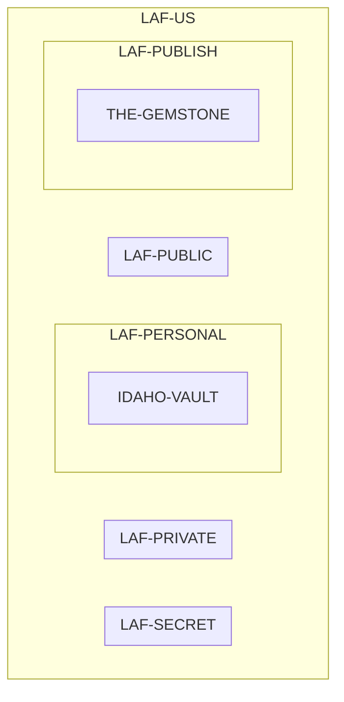

# LAF-US Org Topology

**LAF-US = LAF-SECRET + LAF-PRIVATE + LAF-PERSONAL + LAF-PUBLIC + LAF-PUBLISH**

---

> LAF-US is the sum of its five repo cores, ordered from most private to most public.
> Each named project lives inside exactly one repo core that matches its visibility tier.
