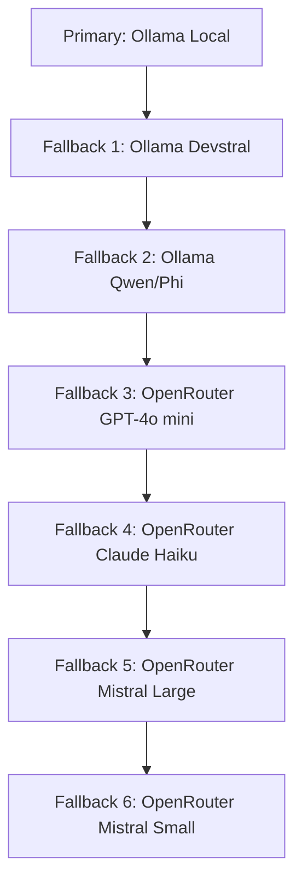

# IDAHO-VAULT LLM/AI Stack
## Agent & Model Configuration Registry

**Date:** April 28, 2026  
**Status:** ✅ Active — Living document

---

## EXECUTIVE SUMMARY

**Active Stack:**
- ✅ **Hermes Agent** — Local Ollama + OpenRouter fallback
- ✅ **OpenRouter** — Unified API for 300+ models

**Available Agents:**
- ✅ Claude Code (The Abhorsen)
- ✅ Gemini CLI (The Concierge)
- ✅ OpenAI Codex (The Lexicographer)
- ✅ GitHub Copilot (The Clerk)

**All agents follow the Swarmic Nest topology:**
- `!/` — Collective swarm space (canonical registry)
- `.*/` — Personal chambers (individual agent configs)

---

## ACTIVE STACK

### 1. Hermes Agent

**Role:** Primary coding & task agent
**Status:** ✅ Active, configured, tested

#### Configuration

| Setting | Value |
|---------|-------|
| Config | `~/.hermes/config.yaml` |
| Env | `~/.hermes/.env` |
| Provider | Ollama Local (primary) + OpenRouter (fallback) |
| Default Model | `mistral-large` |

#### Provider Chain



#### Local Models (Ollama)

| Model | Size | Status | Purpose |
|-------|------|--------|---------|
| `mistral-large` | ~14 GB | ✅ Target | Primary local reasoning |
| `devstral` | ~14 GB | ✅ Target | Primary local coding |
| `qwen3.5` | 6.6 GB | ✅ Ready | General tasks |
| `phi3:mini` | 2.2 GB | ✅ Ready | Lightweight tasks |
| `qwen2.5:3b` | 1.9 GB | ✅ Ready | Minimal/quick tasks |
| `codestral:latest` | ~14 GB | ⏳ Downloading | Code generation |
| `devstral:latest` | ~14 GB | ⏳ Downloading | Code understanding |
| `mistral-large:latest` | ~73 GB | ⏳ Downloading | Complex reasoning |

#### Cloud Models (OpenRouter)

| Provider | Model | Status | Purpose |
|----------|-------|--------|---------|
| OpenRouter GPT-4o mini | `openrouter/openai/gpt-4o-mini` | ✅ Ready | Best available model |
| OpenRouter Claude Haiku | `openrouter/anthropic/claude-3.5-haiku` | ✅ Ready | Budget-friendly tasks |
| OpenRouter Mistral Large | `openrouter/mistralai/mistral-large-2411` | ✅ Ready | Broader fallback |
| OpenRouter Mistral Small | `openrouter/mistralai/mistral-small-2603` | ✅ Ready | Lightweight fallback |

#### Environment

```bash
# ~/.hermes/.env
OPENROUTER_API_KEY=sk-or-v1-xxx  # ✅ Configured
```

---

### 2. OpenRouter

**Role:** Unified API gateway
**Status:** ✅ Active, configured, tested

#### Configuration

| Setting | Value |
|---------|-------|
| Config | `/Users/logan/IDAHO-VAULT/.op/openrouter.env` |
| API Key | ✅ Configured |
| Free Tier | 50 req/day (rate-limited) |
| Paid Tier | ~$10 credit = 1M free requests |

#### Key Models

| Model | Provider | Context | Status |
|-------|----------|---------|--------|
| GPT-4o mini | OpenAI | 128K | ✅ Ready |
| Claude 3.5 Haiku | Anthropic | 200K | ✅ Ready |
| Mistral Large 2411 | Mistral | 131K | ✅ Ready |
| Mistral Small 2603 | Mistral | 131K | ✅ Ready |

---

## AVAILABLE AGENTS

### 1. Claude Code (The Abhorsen)

**Role:** Code authority
**Status:** ⚠️ Configured, not active

#### Configuration

| Setting | Value |
|---------|-------|
| Dotfolder | `/Users/logan/IDAHO-VAULT/.claude/` |
| Config | `CLAUDE.md` |
| Local Config | `~/.claude/` |
| API Key | ❌ Not configured |
| Provider | Anthropic |

#### Activation Steps

```bash
# 1. Set Anthropic API key
mkdir -p ~/.claude
echo "ANTHROPIC_API_KEY=sk-ant-xxx" >> ~/.claude/.env

# 2. Update Hermes config to include Claude provider
hermes config edit
```

---

### 2. Gemini CLI (The Concierge)

**Role:** Support & multimodal
**Status:** ⚠️ Configured, not active

#### Configuration

| Setting | Value |
|---------|-------|
| Dotfolder | `/Users/logan/IDAHO-VAULT/.gemini/` |
| Config | `GEMINI.md` |
| Local Config | `~/.gemini/` |
| API Key | ❌ Not configured |
| Provider | Google |

#### Activation Steps

```bash
# 1. Set Google API key
mkdir -p ~/.gemini
echo "GOOGLE_API_KEY=AIxxx" >> ~/.gemini/.env

# 2. Update Hermes config to include Gemini provider
hermes config edit
```

---

### 3. OpenAI Codex (The Lexicographer)

**Role:** Scripting & automation
**Status:** ⚠️ Configured, not active

#### Configuration

| Setting | Value |
|---------|-------|
| Dotfolder | `/Users/logan/IDAHO-VAULT/.codex/` |
| Config | `CODEX.md` |
| Local Config | `~/.codex/` |
| API Key | ❌ Not configured |
| Provider | OpenAI |

#### Activation Steps

```bash
# 1. Set OpenAI API key
mkdir -p ~/.codex
echo "OPENAI_API_KEY=sk-xxx" >> ~/.codex/.env

# 2. Update Hermes config to include Codex provider
hermes config edit
```

---

### 4. GitHub Copilot (The Clerk)

**Role:** Admin & IDE integration
**Status:** ⚠️ Instructions available, not active

#### Configuration

| Setting | Value |
|---------|-------|
| Instructions | `/Users/logan/IDAHO-VAULT/.github/copilot-instructions.md` |
| API Key | ❌ Not configured |
| Provider | GitHub |

#### Activation Steps

```bash
# 1. Authenticate with GitHub Copilot
gh auth login

# 2. Configure Copilot CLI
copilot configure
```

---

## AGENT REGISTRY

| Agent | Dotfolder | Governance Shim | Status | Role |
|-------|-----------|------------------|--------|------|
| Hermes | `~/.hermes/` | `!/AGENTS.md` | ✅ Active | Primary task agent |
| Claude Code | `~/.claude/` | `.claude/CLAUDE.md` | ⚠️ Configured | Code authority |
| Gemini CLI | `~/.gemini/` | `.gemini/GEMINI.md` | ⚠️ Configured | Support & multimodal |
| OpenAI Codex | `~/.codex/` | `.codex/CODEX.md` | ⚠️ Configured | Scripting & automation |
| GitHub Copilot | `~/.github/` | `.github/copilot-instructions.md` | ⚠️ Instructions | IDE integration |

---

## CONFIGURATION REFERENCE

### OpenRouter

**Config:** `/Users/logan/IDAHO-VAULT/.op/openrouter.env`

```bash
OPENROUTER_API_KEY=op://IDAHO-VAULT/OpenRouter API Key/credential
OPENAI_API_KEY=op://IDAHO-VAULT/OpenRouter API Key/credential
OPENAI_BASE_URL=https://openrouter.ai/api/v1
ANTHROPIC_AUTH_TOKEN=op://IDAHO-VAULT/OpenRouter API Key/credential
```

### Hermes

**Config:** `~/.hermes/config.yaml`

```yaml
model:
  provider: ollama-local
  default: mistral-large

providers:
  ollama-local:
    api: http://127.0.0.1:11434/v1
    api_key: ollama
    default_model: mistral-large
    models: [mistral-large, devstral, qwen3.5, phi3:mini, qwen2.5:3b]

  ollama-devstral:
    api: http://127.0.0.1:11434/v1
    api_key: ollama
    default_model: devstral

  ollama-qwen:
    api: http://127.0.0.1:11434/v1
    api_key: ollama
    default_model: qwen3.5

  ollama-light:
    api: http://127.0.0.1:11434/v1
    api_key: ollama
    default_model: phi3:mini

  openrouter-gpt4o:
    api: https://openrouter.ai/api/v1
    api_key: env:OPENROUTER_API_KEY
    default_model: openrouter/openai/gpt-4o-mini

  openrouter-haiku:
    api: https://openrouter.ai/api/v1
    api_key: env:OPENROUTER_API_KEY
    default_model: openrouter/anthropic/claude-3.5-haiku

  openrouter-mistral-large:
    api: https://openrouter.ai/api/v1
    api_key: env:OPENROUTER_API_KEY
    default_model: openrouter/mistralai/mistral-large-2411

  openrouter-mistral:
    api: https://openrouter.ai/api/v1
    api_key: env:OPENROUTER_API_KEY
    default_model: openrouter/mistralai/mistral-small-2603

fallback_providers:
- ollama-devstral
- ollama-qwen
- ollama-light
- openrouter-gpt4o
- openrouter-haiku
- openrouter-mistral-large
- openrouter-mistral
```

**Env:** `~/.hermes/.env`

```bash
OPENROUTER_API_KEY=sk-or-v1-xxx
```

---

## ACTIVATION CHECKLIST

### To Activate Additional Agents

- [ ] **Claude Code** — Set `ANTHROPIC_API_KEY` in `~/.claude/.env`
- [ ] **Gemini CLI** — Set `GOOGLE_API_KEY` in `~/.gemini/.env`
- [ ] **OpenAI Codex** — Set `OPENAI_API_KEY` in `~/.codex/.env`
- [ ] **GitHub Copilot** — Run `gh auth login` and `copilot configure`

### To Complete Hermes Setup

- [ ] Wait for `codestral`, `devstral`, `mistral-large` downloads
- [ ] Update Hermes config with downloaded model names
- [ ] Run `hermes doctor` to verify setup
- [ ] Test fallback chain with `hermes --continue`

---

## RESOURCES

| Resource | Location |
|----------|----------|
| Hermes Config Guide | `HERMES-OLLAMA-OPENROUTER-SETUP-2026-04-28.md` |
| OpenRouter Research | `OPENROUTER-2026-04-28.md` |
| Nous Research | `NOUS-RESEARCH-HERMES-AGENT-2026-04-28.md` |
| OpenRouter Docs | [openrouter.ai/docs](https://openrouter.ai/docs) |
| Hermes Docs | [hermes-agent.nousresearch.com/docs](https://hermes-agent.nousresearch.com/docs) |

---

## NOTES

- OpenRouter free tier: 50 req/day (rate-limited)
- Paid tier: ~$10 credit = 1M free requests
- Ollama must be running (`ollama serve`)
- Models load into RAM when first used
- Hermes skills follow `agentskills.io` open standard

---

*Documentation created via Hermes Agent session — April 28, 2026*
