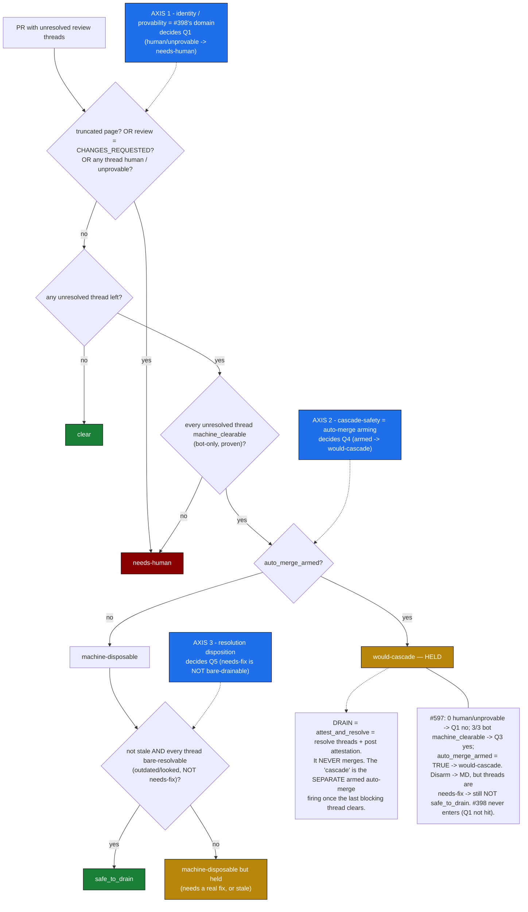

# Looker Lane Classifier — Behavioral Map

*Filed by [[Claude Code]] (software NAME; no delegated TITLE or OFFICE claimed this session) — 2026-06-21*
*Branch: `claude/github-reviewers-research-u8hlk0`*
*Class: research / INQUIRY — a control-flow read, not adopted policy. Companion to the Map v1 topology figures and GitHub issue #399 (the look-then-resolve resolution lane).*

---

## Why this exists (the correction it records)

The Map v1 figures so far are **topology** — static wiring, workflow → script. They show which
rooms connect, not the logic that runs between them. The behavior that actually governs the
review-thread backlog — *which PRs the looker may clear, and why* — lives in one function's
**control flow**, and a wiring map cannot hold it. This doc draws the missing kind of diagram:
`_classify_pr_for_looker` (`review_feedback_loop.py`, read from `origin/main` 2026-06-21) as a
decision machine. It is filed because reasoning about this behavior from the topology map produced
repeated, confident errors; the state machine is what keeps the reading honest.

## The decision machine



## Three independent gates (the thing the topology map hid)

The classifier is not one test — it is **three orthogonal gates at three decision points**.
Conflating any two of them produces wrong conclusions:

| Gate | Decides | Signal | Domain |
| --- | --- | --- | --- |
| **Q1 — identity / provability** | `human` or `unprovable` thread → `needs-human` | is the thread *provably* bot-only? | **#398** (distinct signed agent identity). While agents commit as the maintainer, agent-as-human threads can't be proven bot-only and err safe to `needs-human`. |
| **Q4 — cascade-safety** | bot-clearable + `auto_merge_armed` → `would-cascade` (HELD) | is GitHub auto-merge armed on this PR? | **Arming**, nothing else. Independent of who authored the threads. |
| **Q5 — resolution disposition** | `safe_to_drain` only if every thread is **bare-resolvable** (`outdated`/`looked`), not `needs-fix`/`apply-suggestion` | does the thread need a real fix, or just a clear? | The work itself. A `needs-fix` thread needs an actual change before any resolve. |

Verbatim from `_classify_pr_for_looker`:

```text
if threads_truncated or review_decision == "CHANGES_REQUESTED" or human or unprovable:
    lane = "needs-human"
elif not unresolved:
    lane = "clear"
elif machine_clearable == len(unresolved):
    lane = "would-cascade" if auto_merge_armed else "machine-disposable"
```

```text
safe_to_drain = lane == "machine-disposable" and not stale
                and all(thread.resolution in BARE_RESOLVABLE_DISPOSITIONS for thread in plan)
```

## Drain is not merge

The single most load-bearing fact, from `attest_and_resolve`'s own docstring: *"NEVER merges and
NEVER enables auto-merge — it resolves that single thread and posts the looker's attestation as a
thread reply."* So:

- **DRAIN** = resolve threads + attest. No merge, ever.
- A `would-cascade` PR is held **because** auto-merge is armed: the conversation-resolution gate is
  the *last* barrier, so clearing the final thread lets the **separate** armed auto-merge fire and
  the PR merges as a side effect of draining. The looker refuses to be that trigger.
- **"Drainable" therefore means "safe to clear the threads *because* clearing won't merge it"** —
  the *opposite* of "eligible to be auto-merged." Disarming auto-merge decouples Q4 from the merge;
  it makes clearing safe, it does not make the PR more mergeable.

## Worked example — #597 (this PR), from the live `looker-walk` census 2026-06-20

`lane = would-cascade`, `auto_merge_armed = true`, `safe_to_drain = false`, 3 unresolved threads
all `bot-disposable` / `needs-fix` (CodeRabbit ×1, Copilot ×2), `human_threads = 0`,
`unprovable_threads = 0`, `review_decision = null`, not stale, not truncated.

Trace: Q1 **no** (0 human/unprovable) → Q2 yes → Q3 **yes** (3/3 machine_clearable) → Q4
**armed → `would-cascade`**. The hold is entirely Q4. Disarming auto-merge would move it to
`machine-disposable`, but its threads are `needs-fix`, so Q5 still withholds `safe_to_drain` — it
needs the actual fixes, not a bare clear. **#398 never enters #597's path** (Q1 isn't hit). The
backlog-wide census the same day: 79 open PRs, `would-cascade` 50 / `clear` 28 /
`machine-disposable` 1 / `needs-human` 0, `safe_to_drain` **0** — almost everything held at Q4 by
broad auto-merge arming, which is the maintainer-identity problem Q1/#398 addresses on a *different*
axis.

---

*Provenance: `git show origin/main:.github/scripts/review_feedback_loop.py` — `_classify_pr_for_looker`
and `attest_and_resolve` — read 2026-06-21; census from looker-walk run 27887540491 (2026-06-20).
Mermaid validated with `@mermaid-js/mermaid-cli` before commit. No code or workflow changed.*
